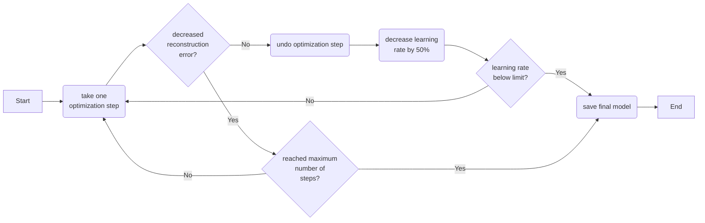

# CYCLOPS 2.0
by [Jan A. Hammarlund](https://github.com/JanHammarlund) and [Dr. Ron C. Anafi](https://github.com/ranafi)  
  
CYCLOPS (Cyclic Ordering by Periodic Structure) is designed to reconstruct the temporal ordering of high dimensional data generated by a common periodic process.
This module is an improvement to the original CYCLOPS.
The improved CYCLOPS 2.0 is written for Julia 1.6.  
  
This repository contains two '.jl' files.
'CYCLOPS.jl' contains all the functions necessary to pre-process data, train CYCLOPS 2.0, and calculate cosinors of best fit for all transcripts using CYCLOPS sample phase predictions.
'CYCLOPS_2_0_Template.jl' calls the necessary functions from 'CYCLOPS.jl' to order an expression file, given a list of seed genes and hyperparameters.
The 'CYCLOPS_2_0_Template.jl' script is copied and pasted into a terminal running Julia 1.6.  
  
***For a quick start guide, skip to the 'Packages' section.***  
  
# Contents  
1. Data Pre-Processing  
2. Covariate Processing  
3. CYCLOPS Architecture  
4. Phase & Magnitude  
5. Model Optimization
6. Assessing Transcript Rhythmicity
7. Packages  
8. Hyperparameters  
9. Expression Data File  
10. Seed Genes  
11. Covariates  
12. Sample Collection Times    
13. CYCLOPS.Fit  
14. CYCLOPS.Align  
15. Contact  
   
# 1. Data Pre-Processing  
Pre-processing methods are performed as described by Anafi et al. 2017$`^{[6 (1)]}`$.  
  
## 1.1 Gene Filtering  
Probes are restricted to those in the “seed gene” list (*see 'Seed Genes'*) and the top 10,000 most highly expressed (*see ':seed_mth_Gene' in 'Hyperparameters'*).
Of these, the list is further limited to those with a coefficient of variation between 0.14 and 0.9 (*see ':seed_min_CV' and ':seed_max_CV' in 'Hyperparameters'*).  
  
## 1.2 Seed Gene Expression  
For these probes, extreme expression values are capped at the top/bottom 2.5th percentile (*see ':blunt_percent' in 'Hyperparameters'*).
The expression $X_{i,j}$ of each included probe $i$ in sample $j$ is scaled to give $S_{i,j}$:  
  
```math  
\quad\quad\quad\quad    S_{i,j}=\frac{X_{i,j}-M_i}{M_i},   \quad\quad\quad\quad\dots(f1)  
```  
  
where $M_i$ is the mean expression of probe $i$ across samples: 
  
```math
\quad\quad\quad\quad    M_i=\Big(\frac{1}{N}\Big)\sum_j^kX_{i,j}.    \quad\quad\quad\quad\dots(f2)
```
  
## 1.3 Eigengene Expression  
The $S_{i,j}$ data are expressed in eigengene coordinates $E_{i,j}$ following the methods of Alter et al$`^{[(2)]}`$.
The number of eigengenes $N_E$ (singular values) retained is set to capture 85% of the seed data’s total variance (*see ':eigen_total_var' in 'Hyperparameters'*), and an eigengene must contribute at least 6% of the data's total variance to be included (*see ':eigen_contr_var' in 'Hyperparameters*), as described by Anafi et al. 2017$`^{[6 (1)]}`$.  
  
# 2. Covariate Processing
Discontinuous covariates are encoded into multi-hot flags.
Multi-hot encoding results in an $M$-by-$`k`$ matrix, where $`k`$ is the number of samples in the dataset, and $M$ is the sum of all covariate groups less the number of covariates $`C`$:  
  
```math  
\quad\quad\quad\quad    M=\sum_{c=1}^C(m_c)-C.   \quad\quad\quad\quad\dots(f3)  
```  
  
$`m_c`$ is the number of groups in covariate $`c`$.  
  
## 2.1 Example Covariate Processing 1
*Why use multi-hot encoding?*
To reduce the number of free (trainable) parameters.
Consider a hypothetical dataset $`EG_1`$ with $k$ samples from two (2) batches ($`M=1,\ C=1`$).  
  
| Covariate | Sample$`_1`$ | Sample$`_2`$ | Sample$`_3`$ | Sample$`_4`$ | $`\dots`$ | Sample$`_k`$ |
------------|--------------|--------------|--------------|--------------|-----------|--------------|
| Batch     | B1           | B2           | B2           | B1           | $`\dots`$ | B2           |
  
In standard one-hot encoding, a sample from batch one (1) and batch two (2) are represented as  
  
```math
\begin{bmatrix} 1 \\[0.3em] 0 \end{bmatrix}
\ \&
\begin{bmatrix} 0 \\[0.3em] 1 \end{bmatrix}
,\ respectively.
```  
  
This notation contains redundant information.
The first row of the matrix can be ommitted without any loss of information, resulting in multi-hot encodings for samples in batch one (1) and two (2):  
  
```math
[0]\ \&\ [1],\ respectively.  
```
  
This reduces the number of free parameters in a model by the number of eigengenes $`N_E`$ retained for a particular dataset (*see 'CYCLOPS 2.0 Model'*).  
  
## 2.2 Example Covariate Processing 2
Now, consider a hypothetical dataset $`EG_2`$ with $k$ samples from four (4) batches, where samples could be from one of two (2) tissue types ($`M=4,\ C=2`$).  
  
| Covariate | Sample$`_1`$ | Sample$`_2`$ | Sample$`_3`$ | Sample$`_4`$ | $`\dots`$ | Sample$`_N`$ |
------------|--------------|--------------|--------------|--------------|-----------|--------------|
| Batch     | B1           | B2           | B3           | B4           | $`\dots`$ | B3           |
| Type      | T1           | T2           | T1           | T2           | $`\dots`$ | T2           |  
  
Instead of considering these two covariates as a combination of states, which would result in eight (8) possible one-hots...  
  
```math  
\begin{bmatrix} Batch_1\ \&\ Type_1 \\[0.3em] Batch_2\ \&\ Type_1 \\[0.3em] Batch_3\ \&\ Type_1 \\[0.3em] Batch_4\ \&\ Type_1 \\[0.3em] Batch_1\ \&\ Type_2 \\[0.3em] Batch_2\ \&\ Type_2 \\[0.3em] Batch_3\ \&\ Type_2 \\[0.3em] Batch_4\ \&\ Type_2 \end{bmatrix}
```  
  
...we consider each covariate independently.  
  
```math  
\quad \begin{bmatrix} Batch_1 \\[0.3em] Batch_2 \\[0.3em] Batch_3 \\[0.3em] Batch_4 \end{bmatrix}
\ can\ be\ reduced\ to\ 
\begin{bmatrix} Batch_2 \\[0.3em] Batch_3 \\[0.3em] Batch_4 \end{bmatrix}
```  
  
and  
  
```math  
\quad \begin{bmatrix} Type_1 \\[0.3em] Type_2 \end{bmatrix}
\ can\ be\ reduced\ to\ 
\begin{bmatrix} Type_2 \end{bmatrix}.
```  
  
CYCLOPS usese the resulting multi-hot encodings.  
  
```math
\quad \begin{bmatrix} Batch_2 \\[0.3em] Batch_3 \\[0.3em] Batch_4 \\[0.3em] Type_2 \end{bmatrix}.
```  
  
The eight (8) possible multi-hot encodings for these covariates are  
  
```math  
\begin{bmatrix} Batch_2 \\[0.3em] Batch_3 \\[0.3em] Batch_4 \\[0.3em] Type_2 \end{bmatrix} \in
\begin{pmatrix}
\begin{bmatrix} 0 \\[0.3em] 0 \\[0.3em] 0 \\[0.3em] 0 \end{bmatrix},\quad
\begin{bmatrix} 1 \\[0.3em] 0 \\[0.3em] 0 \\[0.3em] 0 \end{bmatrix},\quad
\begin{bmatrix} 0 \\[0.3em] 1 \\[0.3em] 0 \\[0.3em] 0 \end{bmatrix},\quad
\begin{bmatrix} 0 \\[0.3em] 0 \\[0.3em] 1 \\[0.3em] 0 \end{bmatrix},\quad
\begin{bmatrix} 0 \\[0.3em] 0 \\[0.3em] 0 \\[0.3em] 1 \end{bmatrix},\quad
\begin{bmatrix} 1 \\[0.3em] 0 \\[0.3em] 0 \\[0.3em] 1 \end{bmatrix},\quad
\begin{bmatrix} 0 \\[0.3em] 1 \\[0.3em] 0 \\[0.3em] 1 \end{bmatrix},\quad
\begin{bmatrix} 0 \\[0.3em] 0 \\[0.3em] 1 \\[0.3em] 1 \end{bmatrix}
\end{pmatrix}.
```  
  
The maximum number of $`1`$s is equal to the number of covariates $`C`$ in the dataset.
Note that multi-hot encodings have additive relationships.  
  
# 3. CYCLOPS Architecture  
The CYCLOPS 2.0 Model comprises the core structure and the multi-hot encoded layers.
The core structure is the original CYCLOPS structure described in Anafi et al. 2017$`^{[6 (1)]}`$.  
  
## 3.1 Core Architecture  
The core CYCLOPS structure has three (3) layers, namely the dimensionality reduction layer, the circular node, and the dimensionality expansion layer.  
  
```math  
\begin{matrix}
input & \to & dimensionality\ reduction & \to  & circular\ node & \to & dimensionality\ expansion \\[0.3em]
N_E\ dimensions & \to & 2\ dimensions & \to & 2\ dimensions & \to & N_E\ dimensions
\end{matrix}
```  
  
### 3.1.1 Dense Layers  
The dimensionality reduction and expansion layers are fully connected (dense) layers with linear nodes.
They transform the data from $`N_E`$-dimensional space to $`2`$-dimensional space, and back again.  
  
### 3.1.2 Circular Node
The circular node projects the 2-dimensional data to a point on a unit circle.
Given the two dimensional input to the circular node ($`x,\ y`$)  
  
we find the projections onto the unit circle $`\hat{x}`$ and $`\hat{y}`$ in the following manner  
  
```math  
\hat{x}=\frac{x}{\sqrt{x^2+y^2}},\quad\quad and \quad\quad \hat{y}=\frac{y}{\sqrt{x^2+y^2}}.
```  
    
## 3.2 CYCLOPS 2.0 Architecture
CYCLOPS 2.0 adds a wrapper around the core structure, allowing the model to simultaneously learn batch effects in the data.  
  
```math
{\color{#FFDF42}input}\ \to\ multi\text{-}hot\ encoding\ \to\ core\ CYCLOPS\ structure\ \to\ multi\text{-}hot\ decoding
```  
  
The multi-hot encoded and decoded data have the exact dimensions as the input.  
  
### 3.2.1 Multi-hot Encoding Layer  
The multi-hot encoded layers consist of an encoding and decoding side.  
  
```math  
multi\text{-}hot\ encoded\ data = {\color{#FFDF42}input}∘(1+{\color{#00AEEF}W}∙{\color{#5240C7}G})+{\color{#FF0000}b}∙{\color{#5240C7}G}+{\color{#D21ED2}d}.
```  
  
### 3.2.2 Multi-hot Decoding Layer
The encoding and decoding multi-hot layers share the same parameters, only use linear transformations, and are functional inverses.  
  
```math  
multi\text{-}hot\ decoded\ data = \frac{core\ CYCLOPS\ output-({\color{#FF0000}b}∙{\color{#5240C7}G}+{\color{#D21ED2}d})}{1+{\color{#00AEEF}W}∙{\color{#5240C7}G}}
```  
  
### 3.2.3 Notation
- “$`∘`$” is the element-wise matrix product,  
- and “$`∙`$” is the matrix dot product.  
- The input data for sample $`j`$ is a column vector with $`N_E`$ rows.  
- $`G`$ is the covariate multi-hot encoding of sample $`j`$, and a column vector with $M$ rows.  
- $`W`$ is an $`N_E`$-by-$`M`$ (rows-by-columns) matrix.  
- Similarly, $`b`$ is also an $`N_E`$-by-$`M`$ matrix.  
- $`d`$ is a column vector with $`N_E`$ rows.
  
## 3.3 Examples
### 3.3.1 Example Covariate Encoding
Consider $`EG_2\ (M=4,\ C=2)`$, and assume $`N_E=5`$. Let us also assume  
  
```math
{\color{#FFDF42}input_j} = \begin{bmatrix} 1 \\[0.3em] 2 \\[0.3em] 3 \\[0.3em] 4 \\[0.3em] 5 \end{bmatrix},\quad
{\color{#5240C7}G_j} = \begin{bmatrix} 0 \\[0.3em] 1 \\[0.3em] 0 \\[0.3em] 1 \end{bmatrix},\quad
{\color{#00AEEF}W} = \begin{bmatrix} 0.11 & 0.21 & 0.31 & 0.41 \\[0.3em] 0.12 & 0.22 & 0.32 & 0.42 \\[0.3em] 0.13 & 0.23 & 0.33 & 0.43 \\[0.3em] 0.14 & 0.24 & 0.34 & 0.44 \\[0.3em] 0.15 & 0.25 & 0.35 & 0.45 \end{bmatrix},\quad
{\color{#FF0000}b} = \begin{bmatrix} 1.1 & 2.1 & 3.1 & 4.1 \\[0.3em] 1.2 & 2.2 & 3.2 & 4.2 \\[0.3em] 1.3 & 2.3 & 3.3 & 4.3 \\[0.3em] 1.4 & 2.4 & 3.4 & 4.4 \\[0.3em] 1.5 & 2.5 & 3.5 & 4.5 \end{bmatrix},\quad
{\color{#D21ED2}d} = \begin{bmatrix} 1 \\[0.3em] 1 \\[0.3em] 1 \\[0.3em] 1 \\[0.3em] 1 \end{bmatrix}.
```  
  
Then,
  
```math  
{\color{#FFDF42}input}∘(1+W∙G)+b∙C+d =
{\color{#FFDF42} \begin{bmatrix} 1 \\[0.3em] 2 \\[0.3em] 3 \\[0.3em] 4 \\[0.3em] 5 \end{bmatrix}} ∘
\begin{pmatrix} 1 + {\color{#00AEEF}\begin{bmatrix} 0.11 & 0.21 & 0.31 & 0.41 \\[0.3em] 0.12 & 0.22 & 0.32 & 0.42 \\[0.3em] 0.13 & 0.23 & 0.33 & 0.43 \\[0.3em] 0.14 & 0.24 & 0.34 & 0.44 \\[0.3em] 0.15 & 0.25 & 0.35 & 0.45 \end{bmatrix}} ∙
{\color{#5240C7}\begin{bmatrix} 0 \\[0.3em] 1 \\[0.3em] 0 \\[0.3em] 1 \end{bmatrix}}
\end{pmatrix} +
{\color{#FF0000}\begin{bmatrix} 1.1 & 2.1 & 3.1 & 4.1 \\[0.3em] 1.2 & 2.2 & 3.2 & 4.2 \\[0.3em] 1.3 & 2.3 & 3.3 & 4.3 \\[0.3em] 1.4 & 2.4 & 3.4 & 4.4 \\[0.3em] 1.5 & 2.5 & 3.5 & 4.5 \end{bmatrix}} ∙
{\color{#5240C7}\begin{bmatrix} 0 \\[0.3em] 1 \\[0.3em] 0 \\[0.3em] 1 \end{bmatrix}} +
{\color{#D21ED2}\begin{bmatrix} 1 \\[0.3em] 1 \\[0.3em] 1 \\[0.3em] 1 \\[0.3em] 1 \end{bmatrix}}
```  
  
Finally,  
  
```math  
{\color{#FFDF42}\begin{bmatrix} 1 \\[0.3em] 2 \\[0.3em] 3 \\[0.3em] 4 \\[0.3em] 5 \end{bmatrix}} ∘
{\color{#00AEEF}\begin{bmatrix} 1.62 \\[0.3em] 1.64 \\[0.3em] 1.66 \\[0.3em] 1.68 \\[0.3em] 1.70 \end{bmatrix}} +
{\color{#FF0000}\begin{bmatrix} 7.2 \\[0.3em] 7.4 \\[0.3em] 7.6 \\[0.3em] 7.8 \\[0.3em] 8.0 \end{bmatrix}} =
\begin{bmatrix} 8.82 \\[0.3em] 10.68 \\[0.3em] 12.58 \\[0.3em] 14.52 \\[0.3em] 16.50 \end{bmatrix}.  
```  
  
### 3.3.2 Example Covariate Decoding
Assume  
  
```math  
core\ CYCLOPS\ output = \begin{bmatrix} 8.82 \\[0.3em] 10.68 \\[0.3em] 12.58 \\[0.3em] 14.52 \\[0.3em] 16.50 \end{bmatrix},
```  
  
and $`W,\ b,`$ and $`G`$ remain the same. Then,  
  
```math  
\frac{core\ CYCLOPS\ output-({\color{#FF0000}b}∙{\color{#5240C7}G}+{\color{#D21ED2}d})}{1+{\color{#00AEEF}W}∙{\color{#5240C7}G}} =
\frac{
\begin{bmatrix} 8.82 \\[0.3em] 10.68 \\[0.3em] 12.58 \\[0.3em] 14.52 \\[0.3em] 16.50 \end{bmatrix} -
\begin{pmatrix}
{\color{#FF0000}\begin{bmatrix} 1.1 & 2.1 & 3.1 & 4.1 \\[0.3em] 1.2 & 2.2 & 3.2 & 4.2 \\[0.3em] 1.3 & 2.3 & 3.3 & 4.3 \\[0.3em] 1.4 & 2.4 & 3.4 & 4.4 \\[0.3em] 1.5 & 2.5 & 3.5 & 4.5 \end{bmatrix}} ∙
{\color{#5240C7}\begin{bmatrix} 0 \\[0.3em] 1 \\[0.3em] 0 \\[0.3em] 1 \end{bmatrix}} +
{\color{#D21ED2}\begin{bmatrix} 1 \\[0.3em] 1 \\[0.3em] 1 \\[0.3em] 1 \\[0.3em] 1 \end{bmatrix}}
\end{pmatrix}
}{
1 + {\color{#00AEEF}\begin{bmatrix} 0.11 & 0.21 & 0.31 & 0.41 \\[0.3em] 0.12 & 0.22 & 0.32 & 0.42 \\[0.3em] 0.13 & 0.23 & 0.33 & 0.43 \\[0.3em] 0.14 & 0.24 & 0.34 & 0.44 \\[0.3em] 0.15 & 0.25 & 0.35 & 0.45 \end{bmatrix}} ∙
{\color{#5240C7}\begin{bmatrix} 0 \\[0.3em] 1 \\[0.3em] 0 \\[0.3em] 1 \end{bmatrix}}
}.
```  
  
Finally,  
  
```math  
\frac{
\begin{bmatrix} 8.82 \\[0.3em] 10.68 \\[0.3em] 12.58 \\[0.3em] 14.52 \\[0.3em] 16.50 \end{bmatrix} -
{\color{#FF0000}\begin{bmatrix} 7.2 \\[0.3em] 7.4 \\[0.3em] 7.6 \\[0.3em] 7.8 \\[0.3em] 8.0 \end{bmatrix}}
}{
{\color{#00AEEF}\begin{bmatrix} 1.62 \\[0.3em] 1.64 \\[0.3em] 1.66 \\[0.3em] 1.68 \\[0.3em] 1.70 \end{bmatrix}}
} =
{\color{#FFDF42} \begin{bmatrix} 1 \\[0.3em] 2 \\[0.3em] 3 \\[0.3em] 4 \\[0.3em] 5 \end{bmatrix}}.
```  
  
# 4. Phase & Magnitude  
## 4.1 CYCLOPS Sample Phase  
CYCLOPS predicts two sample attributes: 1) the sample phase, and 2) the sample magnitude.
Given the two dimensional input to the circular node ($`x,\ y`$), CYCLOPS phase is given by  
  
```math  
atan2(y,x) =
\begin{cases}
arctan\Big(\frac{\large y}{\large x}\Big) & \quad if\quad x > 0 \\[0.3em]
arctan\Big(\frac{\large y}{\large x}\Big) + \pi & \quad if \quad x < 0 \quad and \quad y \geq 0 \\[0.3em]
arctan\Big(\frac{\large y}{\large x}\Big) - \pi & \quad if \quad x < 0 \quad and \quad y < 0 \\[0.3em]
+ \frac{\large \pi}{\large 2} & \quad if \quad x = 0 \quad and \quad y > 0 \\[0.6em]
- \frac{\large \pi}{\large 2} & \quad if \quad x = 0 \quad and \quad y < 0 \\[0.6em]
undefined & \quad if \quad x = 0 \quad and \quad y = 0
\end{cases}
```  
  
## 4.2 CYCLOPS Sample Magnitude  
Given the two dimensional input to the circular node ($`x,\ y`$), CYCLOPS magnitude is given by  
  
```math  
\nu = \sqrt{x^2 + y^2}
```  
  
# 5. Model Optimization
## 5.1 Loss Function
CYCLOPS 2.0, just like its forerunner, is an autoencoder algorithm.
Its target is to recreate the input—the eigengene expression—in the output.
The loss function is defined as  
  
```math  
(input-output)^2,
```  

also known as the <ins>reconstruction error<ins>.  

## 5.2 Fixed Learning Rate Optimization
The model is trained in two stages.
In stage one, the ADAM optimizer$`^{[7 (3)]}`$ was applied with a learning rate of 0.001 and a β of (0.9, 0.999) (*see ':train_$`\mu`$A' and ':train_$`\beta`$' in 'Hyperparameters'*) for a fixed number of iterations (*see ':train_min_steps' in 'Hyperparameters'*).  
  
## 5.3 Bold Driver Optimization
In stage two, the ADAM optimizer is applied with an initial learning rate of 0.001 and a β of (0.9, 0.999), but if the reconstruction error increases from one iteration to the next, the optimization for that iteration is undone, and the learning rate is scaled by 0.5.
If the reconstruction error is decreased from one iteration to the next, the learning rate was scaled by 1.05.
This optimization is repeated for 2050 iterations (*see ':train_max_steps' in 'Hyperparameters'*) or until the learning rate is reduced 1000-fold (equivalent to 10 consecutive learning rate decreases from the initial point, *see ':train_$`\mu`$A_scale_lim' in 'Hyperparameters'*), whichever comes first.
This is the Flux.jl implementation of the bold-drive optimization implemented in Anafi et. al 2017$`^{[6 (1)]}`$.  
  

  
## 5.4 Collection Time Optimization  
Optionally, CYCLOPS 2.0 can include a secondary loss function, which uses sample collection time, if available for a small number of samples (*see ':train_sample_phase' and ':train_sample_id' in 'Hyperparameters'*).
This can help anchor the CYCLOPS ordering to an external time.
When sample collection times are provided, the sum of the cosine distance between the predicted sample phase and the sample collection time is minimized in parallel to the reconstruction error.
The collection time error is defined as  
  
```math  
t \times (1-\cos(\theta_j - \tau_j)),
```  
  
where $`t`$ is the collection time balance (*see ':train_collection_time_balance' in 'Hyperparameters'*), $`\theta_j`$ is the CYCLOPS predicted phase in radians for sample $`j`$, and $`\tau_j`$ is the collection time in radians for sample $`j`$.  
  
# 6. Assessing Transcript Rhythmicity  
Transcript rhythmicity is assessed using modified cosinor regression as performed by Anafi et al. 2017$`^{[6 (1)]}`$.
Cosinor regression is a statistical method of fitting a sinusoidal function to data$`^{[8 (4)]}`$.
The data are assumed to be the result of a periodic process.
This approach works best when the data are provided for multiple process cycles.
CYCLOPS assigns sample phases between $`0`$ and $`2pi`$, covering only a single cycle.
Therefore, we modify the standard cosinor regression approach to reduce our chances of misidentifying a monotonic process as a cyclic process.  
  
## 6.1 Nested Linear Regression Models  
First, we fit a linear model for the expression of each transcript independently  
  
```math  
\quad\quad\quad\quad    g_{i,j}=l_i(\theta _j - \phi_{i}) + c_i + \epsilon _i   \quad\quad\quad\quad\dots[M1]  
```  
  
where $`\theta _j`$ is the raw CYCLOPS predicted sample phase for sample $`j`$, $`l_i`$ is the linear term for transcript $`i`$ that multiplies $`\theta _j`$, $`c_i`$ is the offset term for transcript $`i`$, and $`\epsilon _i`$ is the residual term for transcript $`i`$.
Using a brute force search, we find the shift $`\phi_i`$ that minimizes the sum of square errors for transcript $`i`$ (*see ':cosine_shift_iterations' in 'Hyperparameters'*).
  
# 7. Packages
This module requires the following packages (- version)  
```
CSV --------------- v0.10.4  
DataFrames -------- v1.3.4  
Distributions ----- v0.25.68  
Flux -------------- v0.13.5  
MultipleTesting --- v0.5.1  
MultivariateStats - v0.10.0  
Plots ------------- v1.38.11  
PyPlot ------------ v2.11.0  
Revise ------------ v3.4.0  
StatsBase --------- v0.33.21  
XLSX -------------- v0.8.4  
Dates  
Distributed  
LinearAlgebra  
Random  
Statistics  
```
  
# 8. Hyperparameters  
Hyperparameters are stored in a single dictionary to reduce the number of individual input arguments to the *CYCLOPS.Fit* and *CYCLOPS.Align* functions.
Below is the default hyperparameter dictionary, including default values.
It is not recommended to alter default values unless absolutely necessary.
Any changes to the values of the hyperparameter dictionary will result in warnings printed to the REPL when running the *CYCLOPS.Fit* function.
  
## 8.1 Hyperparameters with Default Values
```julia
Dict(  
  :regex_cont => r".*_C",                # What is the regex match for continuous covariates in the data file?
  :regex_disc => r".*_D",                # What is the regex match for discontinuous covariates in the data file?

  :blunt_percent => 0.975,               # What is the percentile cutoff below (lower) and above (upper) which values are capped?

  :seed_min_CV => 0.14,                  # The minimum coefficient of variation a gene of interest may have to be included in eigengene transformation
  :seed_max_CV => 0.7,                   # The maximum coefficient of a variation a gene of interest may have to be included in eigengene transformation
  :seed_mth_Gene => 10000,               # The minimum mean a gene of interest may have to be included in eigengene transformation

  :norm_gene_level => true,              # Does mean normalization occur at the seed gene level
  :norm_disc => false,                   # Does batch mean normalization occur at the seed gene level
  :norm_disc_cov => 1,                   # Which discontinuous covariate is used to mean normalize seed level data

  :eigen_reg => true,                    # Does regression against a covariate occur at the eigengene level
  :eigen_reg_disc_cov => 1,              # Which discontinous covariate is used for regression
  :eigen_reg_exclude => false,           # Are eigengenes with r squared greater than cutoff removed from final eigen data output
  :eigen_reg_r_squared_cutoff => 0.6,    # This cutoff is used to determine whether an eigengene is excluded from final eigen data used for training
  :eigen_reg_remove_correct => false,    # Is the first eigengene removed (true --> default) or it's contributed variance corrected by batch regression (false)

  :eigen_first_var => false,             # Is a captured variance cutoff on the first eigengene used
  :eigen_first_var_cutoff => 0.85,       # Cutoff used on captured variance of first eigengene

  :eigen_total_var => 0.85,              # Minimum amount of variance required to be captured by included dimensions of eigengene data
  :eigen_contr_var => 0.06,              # Minimum amount of variance required to be captured by a single dimension of eigengene data
  :eigen_var_override => false,          # Is the minimum amount of contributed variance ignored
  :eigen_max => 30,                      # Maximum number of dimensions allowed to be kept in eigengene data

  :out_covariates => true,               # Are covariates included in eigengene data
  :out_use_disc_cov => true,             # Are discontinuous covariates included in eigengene data
  :out_all_disc_cov => true,             # Are all discontinuous covariates included if included in eigengene data
  :out_disc_cov => 1,                    # Which discontinuous covariates are included at the bottom of the eigengene data, if not all discontinuous covariates
  :out_use_cont_cov => false,            # Are continuous covariates included in eigen data
  :out_all_cont_cov => true,             # Are all continuous covariates included in eigengene data
  :out_use_norm_cont_cov => false,       # Are continuous covariates Normalized
  :out_all_norm_cont_cov => true,        # Are all continuous covariates normalized
  :out_cont_cov => 1,                    # Which continuous covariates are included at the bottom of the eigengene data, if not all continuous covariates, or which continuous covariates are normalized if not all
  :out_norm_cont_cov => 1,               # Which continuous covariates are normalized if not all continuous covariates are included, and only specific ones are included

  :init_scale_change => true,            # Are scales changed
  :init_scale_1 => false,                # Are all scales initialized such that the model sees them all as having scale 1
                                         # Or they'll be initialized halfway between 1 and their regression estimate.

  :train_n_models => 80,                 # How many models are being trained
  :train_μA => 0.001,                    # Learning rate of ADAM optimizer
  :train_β => (0.9, 0.999),              # β parameter for ADAM optimizer
  :train_min_steps => 1500,              # Minimum number of training steps per model
  :train_max_steps => 2050,              # Maximum number of training steps per model
  :train_μA_scale_lim => 1000,           # Factor used to divide learning rate to establish smallest the learning rate may shrink to
  :train_circular => false,              # Train symmetrically
  :train_collection_times => true,       # Train using known times
  :train_collection_time_balance => 0.1, # How is the true time loss rescaled

  :cosine_shift_iterations => 192,       # How many different shifts are tried to find the ideal shift
  :cosine_covariate_offset => true,      # Are offsets calculated by covariates

  :align_p_cutoff => 0.05,               # When aligning the acrophases, what genes are included according to the specified p-cutoff
  :align_base => "radians",              # What is the base of the list (:align_acrophases or :align_phases)? "radians" or "hours"
  :align_disc => false,                  # Is a discontinuous covariate used to align (true or false)
  :align_disc_cov => 1,                  # Which discontinuous covariate is used to choose samples to separately align (is an integer)
  :align_other_covariates => false)      # Are other covariates included
```
  
## 8.2 Hyperparameters without Default Values
Some parameters do not have default values.
These parameters come in pairs, meaning that if one parameter is added to the hyperparameter dictionary, the other parameter must also be added.  
  
```julia  
# Pair 1
:train_sample_id    # Array{Symbol, 1}. Sample ids for which collection times exist.  
:train_sample_phase # Array{Number, 1}. Collection times for each sample id. 'train_sample_id' and 'train_sample_phase' must be the same length.  
  
# Pair 2
:align_samples      # Array{String, 1}. Sample ids for which collection times exist.  
:align_phases       # Array{Number, 1}. Collection times for each sample id. 'align_samples' and 'align_phases' must be the same length.  
  
# Pair 3
:align_genes        # Array{String, 1}. Genes with known acrophases.  
:align_acrophases   # Array{Number, 1}. Acrophases for each gene. 'align_genes' and 'align_acrophases' must be the same length.  
```  
  
# 9. Expression Data File
## 9.1 Constraints  
The expression data are a required input to the *CYCLOPS.Fit* and *CYCLOPS.Align* functions.
The format of the expression data file must follow these rules:  
  
1. Each column is a sample.
2. Each row is a transcript.
3. The first column of the dataset contains gene symbols and covariate labels (*see 'Covariates' and 'Hyperparameters'*).
4. All covariate rows come before expression data (*see 'Covariates'*).
5. Samples and columns with 'missing' or 'NaN' values should be removed from the dataset.
6. Column names start with letters and only contain numbers, letters, and underscores ('_').
7. All Gene symbols should start with letters.
8. Duplicate gene symbols **are** allowed.
9. Duplicate column names are **NOT** allowed.
  
## 9.2 Example Expression Data File
```
12869×653 DataFrame
   Row │ Gene_Symbol   GTEX_1117F_2826_SM_5GZXL  GTEX_1122O_1226_SM_5H113  GTEX ⋯
───────┼─────────────────────────────────────────────────────────────────────────
     1 │ tissueType_D  NonTumor                  Tumor                     NonT ⋯
     2 │ site_D        B1                        B1                        B1
     3 │ WASH7P        10.04                     3.248                     4.82
     4 │ LINC01128     5.357                     7.199                     4.57
     5 │ SAMD11        0.6739                    1.213                     0.46 ⋯
     6 │ NOC2L         64.54                     62.24                     73.7
     7 | NOC2L         65.52                     61.18                     74.8
   ⋮   |      ⋮                   ⋮                         ⋮                   ⋱
 12865 │ MTCP1         6.513                     6.308                     7.13
 12866 │ BRCC3         9.685                     10.12                     16.1
 12867 │ VBP1          34.65                     30.77                     25.4 ⋯
 12868 │ CLIC2         21.85                     30.05                     16.8
 12869 │ TMLHE         5.04                      4.06                      5.24
```
  
# 10. Seed Genes  
## 10.1 Constraints
The seed genes are a required input to the *CYCLOPS.Fit* function.
Seed genes must be provided as a vector of strings (not symbols).
Also consider:  
  
1. Case matters!  
   *"Acot4" in the seed gene list will not match "ACOT4" in the gene symbols of the expression data.*  
2. Provide enough seed genes.  
   *The number of seed genes should be greater than ':eigen_max' (see 'Hyperparameters').*  
3. Seed genes start with letters.  
   *Gene symbols in the expression data should start with letters. Therefore, seed genes should also start with letters.*  
  
## 10.2 Example Seed Genes
```
71-element Vector{String}:
 "ACOT4"
 "ACSM5"
 "ADORA1"
 "ADRB3"
 "ALAS1"
 "ANGPTL2"
 "ARHGAP20"
 "ARNTL"
 ⋮
 "TP53INP2"
 "TSC22D3"
 "TSPAN4"
 "TUSC5"
 "USP2"
 "WEE1"
 "ZEB2"
```
  
# 11. Covariates  
## 11.1 Constraints  
The expression data may contain rows of grouping variables (discontinuous covariates) or continuous variables (continuous covariates).
The following constraints apply:  
  
1. All covariate rows must be above expression data.
2. Grouping variables (discontinuous covariates) must start with letters.  
3. Continuous variables (continuous covariates) must **only** contain numbers.  
4. Within a row of grouping variables (discontinuous covariates), each group must contain at least two (2) or more samples.  
   *Consider sample tissue type as a covariate.
   If the data has 'Non Tumor' and 'Tumor' samples, there should be at least two (2) 'Non Tumor' and two (2) 'Tumor' samples in the data.
   Ideally, the number of samples in each group is greater than ':eigen_max' (see 'Hyperparameters').*  
6. All samples must have values for **all** covariates (rows).  
7. Covariate rows must have unique names.  
8. Covariate rows have regex identifiers <ins>in the gene symbol column</ins>.  
   *The example below, discontinuous covariates end in '_D' and continuous covariates end in '_C' (see 'Hyperparameters').*  
  
## 11.2 Example Covariates
Below is a sample dataset with three (3) covariates and two (2) genes.
Two (2) covariates are discontinuous ('tissueType_D' and 'site_D'), and one (1) is continuous ('age_C').  
  
```  
   Row │ Gene_Symbol   GTEX_1117F_2826_SM_5GZXL  GTEX_1122O_1226_SM_5H113  GTEX ⋯
───────┼─────────────────────────────────────────────────────────────────────────
     1 │ tissueType_D  NonTumor                  Tumor                     NonT ⋯
     2 │ site_D        B1                        B1                        B1
     3 │ age_C         25                        56                        62
     4 │ GENE1         4.32                      27.63                     18.43
     5 │ GENE2         17.58                     21.42                     35.67
```  
  
Note, that the example expression data ('GENE1' & 'GENE2') are below all covariate rows (rows 1-3).
No other covariates (ending in '_D' or '_C') should be present below 'GENE1.'  
  
# 12. Sample Collection Times  
Sample collection times may be provided and added to the hyperparameter dictionary.
These may be used in two different ways:
1. Semi-supervised training.  
   *CYCLOPS optimizes the distance between predicted and provided sample collection times **while training** when sample ids and collection times are added via ':train_sample_id' and ':train_sample_phase'.*  
2. Post-training alignment.  
   *CYCLOPS predicted phases are aligned to sample collection times **after training** when added via ':align_samples' and ':algin_phases'.*  
  
':train_sample_phase' **must** be given in radians ($`0 - 2\pi`$), **NOT** hours.
By default, ':align_phases' and ':align_acrophases' must be given in radians, but should you wish to provide hours, also set ':align_base => "hours"' in the hyperparameter dictionary (*see 'Hyperparameters'*).  

# 13. CYCLOPS.Fit  
*CYCLOPS.Fit* has three (3) input arguments and five (5) outputs.
  
## 13.1 Input Arguments
1. The hyperparameter dictionary (as described in 'Hyperparameters'),  
2. the expression data (as described in 'Expression Data File'),  
3. and the seed genes (as described in 'Seed Genes').  
  
## 13.2 Outputs  
1. The eigen data,  
2. the sample fit,  
3. the eigengene correlations,  
4. the trained model,  
5. and the updated hyperparameter dictionary.  
  
## 13.3 Example Usage of CYCLOPS.Fit  
*CYCLOPS.Fit* may be used with a hyperparameter dictionary...
  
```julia
eigendata, samplefit, eigendatacorrelations, trainedmodel, updatedparameters = CYCLOPS.Fit(expressiondata, seedgenes, hyperparameters)
```
  
or without adding a hyperparameter dictionary. 
  
```julia
eigendata, samplefit, eigendatacorrelations, trainedmodel, updatedparameters = CYCLOPS.Fit(expressiondata, seedgenes)
```
   
When no hyperparameter dictionary is supplied as the third argument to *CYCLOPS.Fit*, the default values for all hyperparameters are used.
Inspect the default hyperparameters using *CYCLOPS.DefaultDict*.  
  
```julia  
CYCLOPS.DefaultDict()
```  
  
# 14. CYCLOPS.Align  
*CYCLOPS.Align* has six (6) input arguments and saves files to a directory (no outputs).  
  
## 14.1 Input Arguments  
1. The expression data (as described in 'Expression Data File'),  
2. the sample fit (second output of CYCLOPS.Fit),  
3. the eigengene correlations (third output of CYCLOPS.Fit),  
4. the trained model (fourth output of CYCLOPS.Fit),  
5. the updated hyperparameter dictionary (fifth output of CYCLOPS.Fit),  
6. and the output path where results are saved.  
  
## 14.2 Saved Files  
*CYCLOPS.Align* creates four (4) subdirectories:  
1. Models  
   *The CYCLOPS model with the lowest reconstruction*
2. Parameters  
   *The hyperparameter dictionary*
3. Plots  
   *Clock face and sample alignment plots*
4. Fits  
   *Sample phase predictions, eigengene correlations, and cosinor regression results*
  
## 14.3 Example Usage of CYCLOPS.Align  
  
```julia
CYCLOPS.Align(expressiondata, samplefit, eigendatacorrelations, trainedmodel, updatedparameters, outputpath)
```
  
## 14.4 Why 'Align?'
CYCLOPS returns a relative ordering of all samples.
Since a circle has no beginning, endpoint, or inherent direction, the raw predicted sample phases must in some way be aligned to the external world.
There are three (3) possible ways to align the raw predicted sample phases:  
  
1. To 17 core clock genes,  
2. to genes of choice,  
3. or to known sample collection times.  
  
The raw predicted sample phases are always aligned to the 17 core clock genes.  
  
```julia  
CYCLOPS.human_homologue_gene_symbol
CYCLOPS.mouse_acrophases
```  
  
Using the raw predicted sample phases, cosinors of best fit are calculated for the 17 core clock genes.
The cosinors of best fit tell us the predicted times at which transcripts are maximally expressed (transcript acrophases).
The predicted transcript acrophases are aligned to 'CYCLOPS.mouse_acrophases.'
Notably, predicted transcript acrophases are only compared for transcripts with a significant cosinor fit ($`p < 0.05`$).  
  
Genes of choice may be provided using ':align_genes' and ':align_acrophases' (*see 'Hyperparameters'*).
As above, raw predicted sample phases are used to calculate cosinors of best fit, this time for the genes of choice.
Predicted acrophases are aligned to ':align_acrophases' for transcripts with a significant fit ($`p < 0.05`$).
*Please provide ':align_acrophases' in radians if ':align_base => "radians"' (see 'Hyperparameters')*.  
  
If sample collection times are known for all (or a subset of) samples, these may be provided using ':align_samples' and ':align_phases' (*see 'Hyperparameters'*).
Raw predicted sample phases are aligned to the provided known sample collection times.
*Please provide ':align_phases' in radians if ':align_base => "radians"' (see 'Hyperparameters')*.  
  
# 15. Contact
Please contact janham@pennmedicine.upenn.edu with questions.
Kindly make the email's subject '***GitHub CYCLOPS 2.0***'.
Please copy and paste the full error in the body of the email and provide the versions of all required packages.
Further, provide the script and all necessary files to recreate the error you are encountering.
Good luck and happy ordering.
